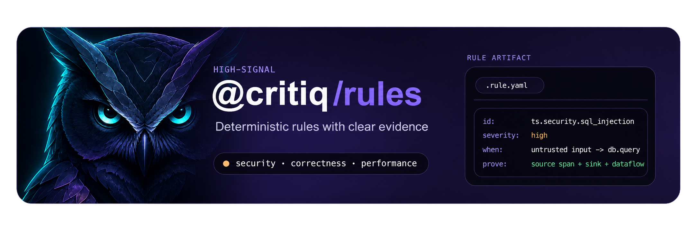

<p align="center">
  
</p>

<h1 align="center">Critiq OSS Rules</h1>
<p align="center">
  <strong>Open source static analysis rules for deterministic code review.<br/>High-signal rules for security, correctness, performance, and code quality.</strong>
</p>
<p align="center">
  <a href="https://www.npmjs.com/package/@critiq/rules"></a>
  <a href="https://github.com/critiq-dev/critiq-rules"></a>
  <a href="https://github.com/critiq-dev/critiq-rules/blob/main/libs/rules/catalog/LICENSE"></a>
</p>


Think of Critiq as an extra code reviewer that scans your project for bugs, security issues, performance problems, and risky changes before they turn into production incidents. Instead of only checking style, it focuses on the kinds of problems that usually slip through review and cause real trouble later. You run it locally or in CI, and it gives you deterministic findings you can act on before merging code.

It does this by parsing your code, matching it against a curated catalog of explicit rules, and reporting findings with concrete evidence tied to the code that triggered them. That means the output is based on repeatable checks for things like unsafe SQL, missing authorization, repeated IO in loops, and untested critical logic changes, not vague heuristics or style-only linting.

This repository contains the published `@critiq/rules` package and the private `@critiq/example-starter-pack` workspace used to author fixtures, smoke-test the packaged CLI, and validate the catalog before release.

<p align="center">
  
</p>

`@critiq/rules` is the default open source rule catalog for Critiq. It ships `catalog.yaml`, preset membership, and rule YAML files for high-signal checks across TypeScript, JavaScript, Node.js, Go, Java, Python, PHP, Ruby and Rust.

If you want the runtime, CLI, and rule DSL that execute this catalog, use [critiq-core](https://github.com/critiq-dev/critiq-core).

Use it with [`@critiq/cli`](https://www.npmjs.com/package/@critiq/cli):

```bash
npm install -D @critiq/cli @critiq/rules
npx critiq check .
```

Run against a diff:

```bash
npx critiq check . --base origin/main --head HEAD
```

## Repository Layout

### Libraries

- [`libs/rules/catalog`](./libs/rules/catalog) is the publishable `@critiq/rules` package with `catalog.yaml`, preset membership, shipped rule YAML files, and package metadata.

### Examples

- [`examples/starter-pack`](./examples/starter-pack) is the private `@critiq/example-starter-pack` workspace with example rules, fixtures, and smoke-test content excluded from npm release versioning.

### Workspace Support

- [`docs/assets`](./docs/assets) contains repo artwork and generated badge assets such as the rule-count JSON.
- [`scripts`](./scripts) contains the workspace verification, release, and packaging helpers used by the root npm scripts.

## Getting Started

This workspace tests against built packages from the sibling `../critiq-core` workspace and requires Node.js 20 or newer.

Typical contributor flow:

```bash
npm run prepare-core-link
npm install
npm run verify
```

`npm run prepare-core-link` builds the sibling `../critiq-core` workspace and verifies every `file:../critiq-core/dist/...` package that this repo consumes.

Useful repo-specific commands:

```bash
npm run build
npm run update:rule-count
npm run smoke:packaged-cli
```

`npm run build` verifies that the packaged `@critiq/rules` output contains `catalog.yaml` and every catalog-referenced rule asset. After catalog changes, run `npm run update:rule-count` to refresh the README count and badge source. Use `npm run smoke:packaged-cli` for a packaged CLI smoke pass against the starter pack.

## Catalog At A Glance

Today the catalog includes `112` rules across `10` categories, with `recommended`, `strict`, `security`, and `experimental` presets.

| Category | Rules | What it looks after |
| --- | ---: | --- |
| Security | 70 | Injection, auth and session gaps, unsafe transport, sensitive data exposure, unsafe file and HTML handling |
| Correctness | 15 | Async bugs, null access, control-flow mistakes, missing fallbacks, race conditions |
| Performance | 10 | Repeated IO, wasted async sequencing, hot-path loops, large retained objects, render churn |
| Quality | 10 | Error handling gaps, oversized functions, coupling, duplicated logic, and weak test coverage |
| Logging | 2 | Console usage and unsafe logging patterns |
| Config | 1 | Configuration access boundaries |
| Next | 1 | Server and client boundary leaks |
| Random | 1 | Unsafe randomness in core logic |
| React | 1 | Cascaded effect fetch patterns |
| Runtime | 1 | Debug-only statements left in shipped code |

## High-Value Rules In This Catalog

| Rule title | Description |
| --- | --- |
| `Hardcoded API keys or credentials` | Source files should not embed credential-like string literals. |
| `Avoid raw or interpolated SQL`  | Database query sinks must not receive request-driven or dynamically interpolated SQL text. |
| `Path traversal via user input` | File access calls must not use request-controlled paths directly. |
| `Protect deserialization trust boundaries` | Deserializers should not consume untrusted payloads directly across a trust boundary. |
| `Server-side request forgery` | Outbound requests should not use attacker-controlled targets or private hosts. |
| `Open redirect via request-controlled target` | Redirect and navigation sinks should not use request-controlled destinations without validation. |
| `Missing authorization before sensitive action` | Sensitive backend actions should be guarded by an authorization or permission check. |
| `Use authenticated encryption for secrets and tokens`  | Session, cookie, and token encryption should provide integrity protection in the same helper. |
| `Missing await on async call` | Async functions should not drop direct async calls without awaiting them. |
| `Repeated IO call inside loop` | Database or network calls inside loops can multiply latency and load. |
| `Logic change without corresponding test updates` | Diffs that change critical logic should usually update the matching tests in the same change. |
| `Avoid server/client boundary leaks in Next.js` | Server components should not use browser-only APIs or client-only hooks without an explicit client boundary. |

## Rule Methodology

Critiq keeps the OSS catalog intentionally high-signal.

- We add rules that change code review outcomes: security flaws, correctness bugs, performance regressions, and maintainability issues with real operational cost.
- We prefer rules that are deterministic, explainable, and backed by fixtures instead of vague heuristics.
- We avoid generic style rules that compilers and standard linters already handle well.
- Every rule should produce an actionable finding with evidence, not restate general guidance.

## More Rules In This Catalog

The catalog also includes these `100` additional rules beyond the highlights above.

### Security

| Rule title | Description |
| --- | --- |
| `Eval or dynamic code execution` | Eval-like helpers, `vm` execution APIs, and string-evaluated timers should not execute dynamic code. |
| `Command execution using untrusted input` | Process execution helpers must not receive request-controlled executables or shell-interpreted arguments. |
| `Avoid unsafe DOM HTML insertion sinks` | `outerHTML`, `document.write*`, and `insertAdjacentHTML` should only receive fixed or explicitly sanitized HTML. |
| `` Avoid unsafe `dangerouslySetInnerHTML` `` | React `dangerouslySetInnerHTML` should only render fixed or explicitly sanitized HTML. |
| `` Avoid unsafe `innerHTML` assignment `` | `innerHTML` assignments should only use fixed or explicitly sanitized HTML. |
| `Missing ownership validation` | Resource identifiers from request input should be checked against the caller before sensitive actions run. |
| `Authorization enforced only on frontend` | Backend routes should enforce authorization directly instead of relying on frontend gating alone. |
| `Token or session not validated` | Session and token values from external input should be verified before authentication or identity use. |
| `Harden auth-bearing cookies` | Auth and session cookies should set HttpOnly, Secure, and SameSite. |
| `Remove sensitive claims from JWT payloads` | JWT payloads should avoid embedding PII or secrets unless absolutely required. |
| `Avoid browser token storage` | Access and session tokens should not be stored in long-lived browser storage. |
| `TLS verification disabled` | Transport clients should not disable certificate verification. |
| `Insecure HTTP transport` | Outbound transport should not use plain HTTP for sensitive requests. |
| `Require modern TLS minimum versions` | Transport clients should not explicitly allow SSLv3, TLS 1.0, or TLS 1.1. |
| `Sensitive data egress to third-party processors` | Sensitive values should not be sent to external processors or outbound SDKs without minimization or redaction. |
| `Avoid sensitive data in logs and telemetry` | Sensitive fields should not be sent to logging, tracing, or analytics sinks. |
| `Avoid binding to all interfaces` | Network-facing services should not explicitly bind to every interface unless public exposure is intentional and protected. |
| `Avoid weak hash algorithms` | Cryptographic hashing should use modern, collision-resistant algorithms. |
| `Avoid weak cipher algorithms and modes` | Cryptographic ciphers should use modern authenticated modes and approved algorithms. |
| `Avoid predictable token generation` | Tokens, reset links, and session secrets should be generated from cryptographically strong randomness. |
| `Use enough entropy for secrets and tokens` | Secret-bearing tokens and secrets should use at least 16 bytes of cryptographic entropy. |
| `Avoid weak key-generation strength` | Key-generation helpers should use current minimum strengths for RSA, AES, and HMAC keys. |
| `Validate untrusted input before parser construction` | Untrusted input should be validated before it is used to construct sensitive parsers or runtime objects. |
| `Missing request timeout or retry protection` | External calls should define timeout, cancellation, or retry behavior before they enter security-sensitive flows. |
| `Review Datadog RUM user interaction capture` | Datadog Browser RUM should not enable broad user interaction capture without a privacy review. |
| `Avoid request-driven DynamoDB queries` | DynamoDB query and scan inputs should not be built directly from request input. |
| `Avoid hardcoded auth secrets` | JWT, session, and strategy secrets should not be embedded directly in source code. |
| `Constrain module-loading trust boundaries` | `require()` and dynamic `import()` should not resolve modules from untrusted input. |
| `Do not reflect request origin into CORS policy` | `Access-Control-Allow-Origin` should not be set from request-controlled input. |
| `Do not allow every origin in CORS policy` | CORS should not fall back to wildcard or implicit allow-all origin settings. |
| `` Set `Secure` on Express session cookies `` | Express session and cookie-session configs should not disable the `Secure` flag. |
| `` Set `HttpOnly` on Express session cookies `` | Express session and cookie-session configs should not disable the `HttpOnly` flag. |
| `Avoid legacy Argon2 password hash modes` | Password hashing should not use `argon2i` or `argon2d` when safer modern modes are available. |
| `Use secure WebSocket transport` | WebSocket clients should not connect over cleartext `ws://` when sensitive application data is involved. |
| `Add a JWT revocation hook` | Express JWT middleware should check revocation state when bearer tokens can be invalidated early. |
| `Keep Handlebars escaping enabled at template trust boundaries` | Server-side Handlebars compilation should not disable HTML escaping with `noEscape: true`. |
| `Avoid ad hoc HTML sanitization` | Hand-rolled HTML escaping and sanitization should be replaced with vetted sanitizers or safe rendering paths. |
| `` Verify `message` event origins `` | `message` handlers should validate `event.origin` before trusting cross-window data. |
| `Avoid request-driven model queries` | Express handlers should not pass raw request objects into NoSQL filters, query helpers, or aggregation pipelines. |
| `Use constant-time secret comparison` | Secrets and tokens should not be compared with ordinary equality operators. |
| `Do not persist upload filenames directly` | Upload handlers should not store attacker-controlled filenames without generating or validating a safe local name. |
| `Constrain local file generation paths` | Local file writes should not derive their destination path from request or upload input. |
| `Avoid attacker-controlled filesystem read paths` | Direct filesystem read APIs should not consume request- or upload-controlled filenames. |
| `Avoid permissive file modes` | Files that can carry user or security data should not be created with world-accessible modes. |
| `` Avoid wildcard `postMessage` targets `` | `postMessage` calls should not use `*` as the target origin when they carry application data. |
| `Avoid raw HTML with request input` | Request-derived values should not be interpolated into raw HTML strings. |
| `Avoid sensitive data in thrown errors` | Exceptions and rejection payloads should not include raw secrets or personal data. |
| `Avoid writing sensitive data to files` | Data exports and local file writes should not persist raw secrets or personal fields. |
| `Avoid leaking sensitive or diagnostic state` | Logs, stdout or stderr, and direct response sinks should not expose sensitive fields or internal diagnostic detail. |
| `Do not derive anti-framing headers from request input` | Framing and CSP headers should not be set from request-controlled values. |
| `Avoid request-controlled format strings` | Logging and formatting helpers should not take request input as the format string itself. |
| `` Constrain `res.sendFile` to a trusted root `` | `res.sendFile()` should not resolve filenames or options from request input without a trusted root. |
| `` Constrain `res.render()` trust boundaries `` | Express view names should not cross into server-side rendering from untrusted input. |
| `Avoid exposed directory listings` | Directory listing middleware should not be enabled on public paths without a deliberate review. |
| `Override Express session defaults` | Express session middleware should not rely on default session naming and configuration. |
| `Override Express cookie defaults` | Express session cookie settings should not omit explicit lifetime, scope, and transport attributes. |
| `Avoid permissive Express session cookie scope` | Express session cookies should not explicitly opt into cross-site or wildcard-style scope. |
| `Serve static assets before session middleware` | Static assets should be mounted before session middleware when they do not need session state. |
| `Apply Helmet to Express apps` | Express apps should use Helmet or equivalent header hardening middleware. |
| `Reduce Express fingerprinting` | Express apps should disable `x-powered-by` or equivalent fingerprinting headers. |
| `Do not expose debug routes or middleware in production` | Debug handlers, stack-showing middleware, and diagnostic endpoints should stay behind explicit development-only guards. |
| `Avoid unsafe raw HTTP response output` | Raw response writers should not echo request data into HTML-capable responses without trusted escaping or sanitization. |

### Correctness

| Rule title | Description |
| --- | --- |
| `Always-true or always-false condition` | Flow-control conditions should not resolve to a constant boolean value. |
| `Implicit undefined return in function` | Functions that return a value on some paths must not fall through implicitly. |
| `Unhandled promise rejection or async error` | Promise chains started in a function should terminate with explicit rejection handling. |
| `Incorrect boolean logic (AND/OR misuse)` | Comparison chains on the same value must use the boolean operator that matches the intended logic. |
| `Blocking call inside async flow` | Async functions should not call synchronous blocking APIs on the hot path. |
| `Missing default case in switch or conditional dispatch` | Dispatch constructs should include an explicit default or final else path. |
| `Missing timeout on external call` | External HTTP calls should declare timeout or cancellation behavior. |
| `Possible null or undefined dereference` | Nullable values should be guarded before property access or invocation. |
| `Nested property access without existence check` | Deep property chains derived from external input should verify intermediate values before access. |
| `Unchecked map or dictionary key access` | Lookups should verify key presence before reading from maps or keyed objects. |
| `Optional value used without fallback` | Optional values should be normalized before arithmetic, concatenation, or other direct use. |
| `Off-by-one error in loop boundaries` | Index-based loops should not skip the first element or iterate one step past the collection boundary. |
| `Race condition on shared state` | Async functions that mutate shared state after an await boundary should be reviewed for races. |
| `Unreachable code after return or throw` | Statements after terminal exits should be removed or moved before the exit. |

### Performance

| Rule title | Description |
| --- | --- |
| `Sequential async calls that could run in parallel` | Independent awaited calls in the same block should not serialize unnecessarily. |
| `Repeated expensive computation` | Repeating the same expensive computation in one block should usually be cached. |
| `Inefficient data structure usage` | Linear membership checks or key projections should be reviewed for more suitable lookup structures. |
| `Nested loops in hot path (O(n²) risk)` | Nested loops in the same function should be reviewed for quadratic work on larger inputs. |
| `Missing batching of operations` | Repeated one-by-one operations inside loops should prefer available batch-style helpers. |
| `Large payload processing without streaming` | Whole-payload reads of likely large content should be reviewed for streaming alternatives. |
| `Potential memory leak from unbounded growth` | Shared collections that only grow should be reviewed for eviction or lifecycle boundaries. |
| `Unnecessarily retained large object` | Large payloads assigned into shared state should be reviewed for shorter lifetimes. |
| `Unnecessary re-renders from state misuse` | React state setters invoked directly during render should be reviewed for rerender loops. |

### Quality

| Rule title | Description |
| --- | --- |
| `Errors swallowed silently` | Catch blocks must log, reject, or rethrow failures instead of dropping them silently. |
| `Function too large or too complex` | Oversized or overly complex functions should be split into smaller units. |
| `Duplicate code block` | Large duplicated function bodies across files make behavior harder to maintain safely. |
| `Deep nesting reducing readability` | Deeply nested control flow should be flattened where practical. |
| `Missing error context or logging` | Catch blocks should include the caught error when they log or rethrow. |
| `Tight coupling between modules` | Direct import cycles between modules increase coupling and make change boundaries harder to maintain. |
| `Hardcoded configuration values` | Config-like values should usually come from configuration sources rather than source literals. |
| `Magic numbers or magic strings` | Non-trivial literals in logic should be named to explain their meaning. |
| `Missing tests for critical logic` | Critical auth, payment, or similar business logic should have a matching test file. |

### Logging

| Rule title | Description |
| --- | --- |
| `Avoid console.log` | Use the project logger instead of console.log. |
| `Avoid console.error` | Route error logs through the project logger. |

### Config

| Rule title | Description |
| --- | --- |
| `` Avoid direct `process.env` access outside config `` | Keep environment variable access inside config modules. |

### Random

| Rule title | Description |
| --- | --- |
| `` Avoid `Math.random()` in core code `` | Core code should not depend on nondeterministic random generation. |

### React

| Rule title | Description |
| --- | --- |
| `Avoid cascaded fetches inside React effects` | React effects should not serialize independent fetches that can run in parallel or move server-side. |

### Runtime

| Rule title | Description |
| --- | --- |
| `` Remove `debugger;` `` | Remove debugger statements before committing source files. |

## License

`@critiq/rules` is licensed under [Apache 2.0](https://www.apache.org/licenses/LICENSE-2.0). See the package [LICENSE](https://github.com/critiq-dev/critiq-rules/blob/main/libs/rules/catalog/LICENSE).
